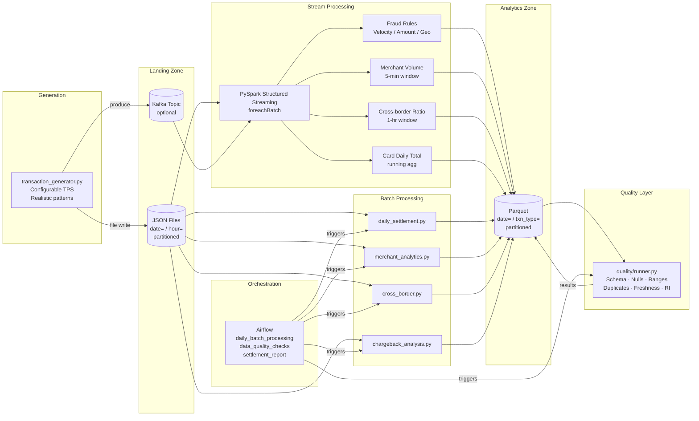

# Payment Transaction Stream Pipeline

A production-grade data engineering pipeline that simulates a payment network's transaction processing system. Ingests a continuous stream of card transactions (purchases, refunds, chargebacks, P2P), processes them through Apache Spark for real-time fraud detection and batch analytics, and lands results in a partitioned data warehouse.

Built to demonstrate: PySpark Structured Streaming, large-scale batch processing, distributed computing patterns, fraud detection logic, data quality frameworks, and Airflow orchestration — using the payments domain.

---

## Architecture



---

## Tech Stack

| Layer | Technology |
|---|---|
| Stream processing | PySpark Structured Streaming 3.5 |
| Batch processing | PySpark 3.5 |
| Orchestration | Apache Airflow 2.9 |
| Data format | Parquet (snappy), NDJSON (landing) |
| Optional streaming source | Apache Kafka (Confluent) |
| Containerisation | Docker / docker-compose |
| Data validation | Pydantic v2, custom PySpark checks |
| Logging | structlog (JSON output) |
| Testing | pytest + chispa |
| Code quality | ruff, black, mypy |

---

## Setup

### Prerequisites

- Docker ≥ 24 and docker-compose ≥ 2.20
- 8 GB RAM available to Docker (Spark workers use 2 GB each)

### Start the stack

```bash
# Copy and configure environment variables
cp .env.example .env

# Start Spark cluster + Airflow (Kafka is opt-in via --profile kafka)
docker-compose up -d

# Verify Spark master is healthy
open http://localhost:8080

# Airflow UI (admin / admin)
open http://localhost:8085
```

### Spark only (no Airflow)

```bash
docker-compose up -d spark-master spark-worker-1 spark-worker-2
```

### With Kafka

```bash
docker-compose --profile kafka up -d
# Set in .env:
#   GENERATOR_OUTPUT_MODE=kafka
#   KAFKA_BOOTSTRAP_SERVERS=kafka:29092
```

---

## Generate Sample Data

```bash
# Generate 60 seconds of transactions at 200 TPS, writing to ./data/landing
docker-compose exec spark-master python -m src.generator.transaction_generator \
  --tps 200 \
  --duration 60 \
  --output-mode file

# Or run locally (requires pip install -r requirements.txt)
python -m src.generator.transaction_generator --tps 500 --duration 300
```

Output lands at `data/landing/transactions/date=YYYY-MM-DD/hour=HH/*.json`.

---

## Run the Streaming Job

```bash
spark-submit \
  --master spark://localhost:7077 \
  --packages io.delta:delta-spark_2.12:3.1.0 \
  --conf spark.sql.adaptive.enabled=true \
  src/streaming/stream_processor.py
```

The job starts four concurrent streaming queries:

| Query | Output | Trigger |
|---|---|---|
| Fraud detection | `analytics/fraud_flags/` | 30 seconds |
| Merchant volume (5-min window) | `analytics/merchant_volume/` | 5 minutes |
| Issuer cross-border ratio (1-hr) | `analytics/issuer_xborder/` | 15 minutes |
| Card daily running total | `analytics/card_daily_totals/` | 10 minutes |

---

## Run Batch Jobs

Each job accepts a `--date YYYY-MM-DD` argument and can be submitted independently.

```bash
# Settlement aggregation
spark-submit \
  --master spark://localhost:7077 \
  src/batch/daily_settlement.py --date 2024-01-15

# Merchant category analysis
spark-submit \
  --master spark://localhost:7077 \
  src/batch/merchant_analytics.py --date 2024-01-15

# Cross-border corridor analysis
spark-submit \
  --master spark://localhost:7077 \
  src/batch/cross_border.py --date 2024-01-15

# Chargeback ratio flagging
spark-submit \
  --master spark://localhost:7077 \
  src/batch/chargeback_analysis.py --date 2024-01-15 --threshold 0.02

# Data quality checks
spark-submit \
  --master spark://localhost:7077 \
  src/quality/runner.py --date 2024-01-15
```

---

## Data Quality Checks

The quality runner executes the following checks after each batch and writes results to `data/quality/data_quality_results/`.

| Check | Description | Failure Condition |
|---|---|---|
| `schema_validation` | All expected columns present | Any required column missing |
| `null_check` | No NULLs in critical fields | NULL in `transaction_id`, `amount`, `timestamp`, `card_hash`, `merchant_id` |
| `referential_integrity` | `merchant_id` exists in dimension | >0 orphan records |
| `amount_range` | Amounts conform to per-type sign rules | Positive refund, negative purchase, etc. |
| `duplicate_check` | `transaction_id` is unique | Any duplicate IDs detected |
| `freshness_check` | Most recent record is recent | Latest record older than 2 hours |
| `transaction_type_check` | Only valid types present | Unknown type values |

---

## Partitioning Strategy

```
data/
├── landing/
│   └── transactions/
│       └── date=2024-01-15/
│           └── hour=10/
│               └── <batch_id>.json        # raw NDJSON
│
├── processed/
│   └── transactions/
│       └── date=2024-01-15/
│           └── transaction_type=purchase/ # Parquet, snappy
│
└── analytics/
    ├── daily_settlement/
    │   └── processing_date=2024-01-15/
    ├── merchant_volume/                   # streaming output, by window
    ├── fraud_flags/
    │   └── transaction_type=purchase/
    └── chargeback_ratios/
        └── processing_date=2024-01-15/
```

**Why this layout:**
- Landing zone partitioned by `date/hour` supports hourly micro-batch reads without scanning the full history.
- Processed zone adds `transaction_type` as a second partition key so downstream queries like `SELECT * WHERE type='chargeback'` skip irrelevant file groups entirely (partition pruning).
- Analytics zone is partitioned by `processing_date` only — these tables are always queried by date range.

Spark reads are never issued against the root path; all jobs pass explicit `date=` predicates so the planner can prune at the directory level before scheduling tasks.

---

## Spark Optimisation Notes

| Technique | Where applied | Reason |
|---|---|---|
| Broadcast joins | All batch jobs joining dimension tables | Merchants/issuers/acquirers are <5 k rows; broadcasting avoids a shuffle-merge on the large fact table |
| AQE (Adaptive Query Execution) | All jobs | Automatically coalesces small partitions, converts sort-merge to broadcast when post-filter sizes are small |
| `spark.sql.shuffle.partitions=64` | All jobs | Default 200 creates thousands of tiny files for our data volume; 64 keeps partition sizes in the 1–10 MB sweet spot |
| Watermark (streaming) | All aggregations | Limits state store growth; prevents unbounded memory use in long-running streaming jobs |
| `foreachBatch` for fraud rules | stream_processor.py | Allows non-streaming-native operations (range-frame windows, multi-table joins) within each micro-batch |
| Parquet filter pushdown | All batch reads | `spark.sql.parquet.filterPushdown=true` pushes predicates into the row-group statistics, reducing I/O |
| Dynamic Partition Pruning | Batch jobs | Enabled in `BATCH_SPARK_CONF`; eliminates partition scans on dimension-filtered fact queries |

---

## Environment Variables

| Variable | Default | Description |
|---|---|---|
| `SPARK_MASTER` | `local[*]` | Spark master URL |
| `LANDING_ZONE_PATH` | `./data/landing` | Raw JSON input path |
| `PROCESSED_ZONE_PATH` | `./data/processed` | Parquet output path |
| `ANALYTICS_ZONE_PATH` | `./data/analytics` | Aggregated outputs path |
| `QUALITY_RESULTS_PATH` | `./data/quality` | DQ check results path |
| `GENERATOR_TPS` | `1000` | Target transactions per second |
| `GENERATOR_DURATION_SECONDS` | `3600` | Generator run duration |
| `GENERATOR_OUTPUT_MODE` | `file` | `file` or `kafka` |
| `KAFKA_BOOTSTRAP_SERVERS` | _(unset)_ | Kafka brokers (enables Kafka mode) |
| `KAFKA_TOPIC_TRANSACTIONS` | `payment.transactions.raw` | Kafka topic name |
| `FRAUD_VELOCITY_WINDOW_SECONDS` | `60` | Velocity rule lookback window |
| `FRAUD_VELOCITY_MAX_TXN` | `5` | Max transactions per card in window |
| `FRAUD_AMOUNT_MULTIPLIER` | `3.0` | Anomaly threshold multiplier |
| `FRAUD_GEO_WINDOW_MINUTES` | `30` | Geo-impossibility detection window |
| `CHARGEBACK_RATIO_THRESHOLD` | `0.02` | Merchant flagging threshold (2%) |
| `SLACK_WEBHOOK_URL` | _(unset)_ | Slack webhook for failure alerts |
| `LOG_LEVEL` | `INFO` | Python log level |
| `LOG_FORMAT` | `json` | `json` or `text` |

---

## Running Tests

```bash
pip install -r requirements.txt
pytest tests/ -v --tb=short

# With coverage
pytest tests/ --cov=src --cov-report=term-missing
```

Tests use a local `SparkSession` in `local[2]` mode — no cluster required.

---

## Project Structure

```
payment-stream-pipeline/
├── src/
│   ├── generator/          # Synthetic data generation
│   ├── streaming/          # PySpark Structured Streaming jobs
│   ├── batch/              # Daily batch Spark jobs
│   ├── quality/            # Data quality checks and runner
│   └── utils/              # Spark session factory, I/O helpers, logging
├── airflow/
│   ├── dags/               # Airflow DAG definitions
│   └── plugins/            # Shared callbacks (Slack, SLA)
├── config/
│   ├── spark_config.py     # Centralised Spark tuning parameters
│   └── pipeline_config.yaml
├── data/
│   ├── seeds/              # Dimension tables (merchants, issuers, etc.)
│   └── sample/             # Example transaction records
└── tests/                  # pytest test suite
```
